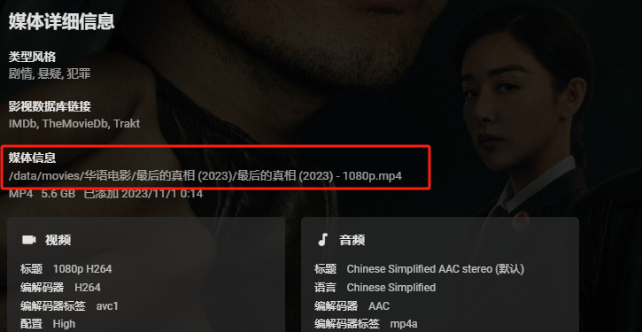

# MoviePilot路径映射

## 1.什么是路径映射？

路径映射针对的是转以后文件的路径

原理：emby/jellyfin删除文件后，emby/jellyfin会通过Scripter X插件或者webhook将`emby/jellyfin中删除文件的路径`传给MoviePilot。

但是路径是相对于emby/jellyfin来说的，MoviePilot要通过路径映射把emby/jellyfin中的路径转换成MoviePilot中的路径！（即：`路径相同可不填路径映射`）

## 2.为什么要填路径映射？

`emby/jellyfin中一个视频可能有多个版本，如果不填路径映射可能会一同删掉`

`如果MoviePilot识别失败，在历史记录重新识别后，加上路径映射可防止误删除（具体原因自己思考吧。）`

## 3.路径映射如何正确配置？

emby/jellyfin中随便找一个视频，查看详情，查看底部`媒体信息`。

如图所示，emby中媒体路径是`/data/movies/华语电影/最后的真相 (2023)/最后的真相 (2023) - 1080p.mp4`

在MoviePilot`历史记录`中搜索该视频 (即：`没在MoviePilot历史记录中的视频不会同步删除`)

如图所示，MoviePilot中媒体路径是`/mnt/link/movies/华语电影/最后的真相 (2023)/最后的真相 (2023) - 1080p.mp4`

插件规则  媒体服务器路径:MoviePilot路径

`/data/movies/华语电影/最后的真相 (2023)/最后的真相 (2023) - 1080p.mp4:/mnt/link/movies/华语电影/最后的真相 (2023)/最后的真相 (2023) - 1080p.mp4`

去除公有部分`/movies/华语电影/最后的真相 (2023)/最后的真相 (2023) - 1080p.mp4`

剩下为正确路径映射配置`/data:/mnt/link`

